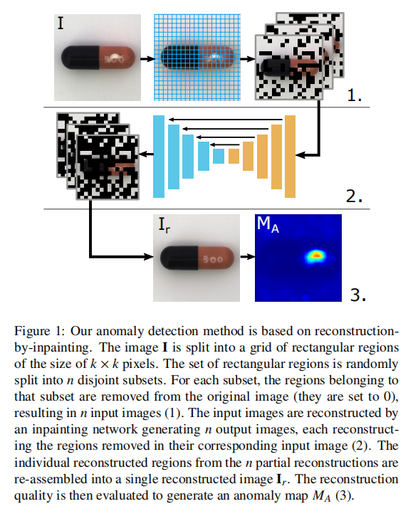
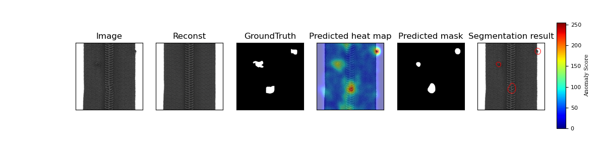

# Reconstruction by Inpainting for visual Anomaly Detection (RIAD) in PyTorch

This is an unofficial implementation of [Reconstruction by inpainting for visual anomaly detection](http://www.sciencedirect.com/science/article/pii/S0031320320305094) (RIAD).

## PipeLine
 

## Prerequisites
* PyTorch 1.5
* sklearn, matplotlib
* kornia ( incompatible with PyTorch>=1.6.0 so far )  
The kornia package is used for its medianfilter function. You may find a substitution if you want to get rid of this dependency.

## Visualization demo of randomly generated mosaic masks
Please check this **[mosaic.ipynb](./mosaic.ipynb)** file

## Usage

To train **RIAD** on `MVTec AD` dataset:
```
python train.py --obj zipper --data_path [your-mvtec_ad-data-path]
```
Then to test:
```
python test.py --obj zipper --data_path [your-mvtec_ad-data-path] --checkpoint_dir [your-saved-weights-path]
```
Finally, you will get results like **img_ROCAUC (anomaly detection) around 0.97** and **pixel_ROCAUC (anomaly segmetation) around 0.98**  

## Localization results


## References
Vitjan Zavrtanik, Matej Kristan, Danijel Skčaj,<br>
Reconstruction by inpainting for visual anomaly detection,<br>
Pattern Recognition,<br>
2020,<br>
107706,<br>
ISSN 0031-3203<br>


## Acknowledgement 
Thanks for the paper authors.  
A big thanks to [xiahaifeng1995](https://github.com/xiahaifeng1995) for contributing most of the codes.